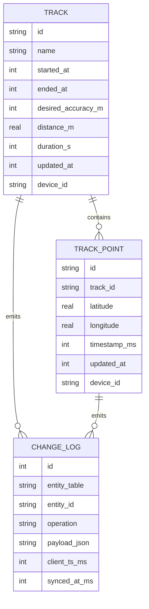
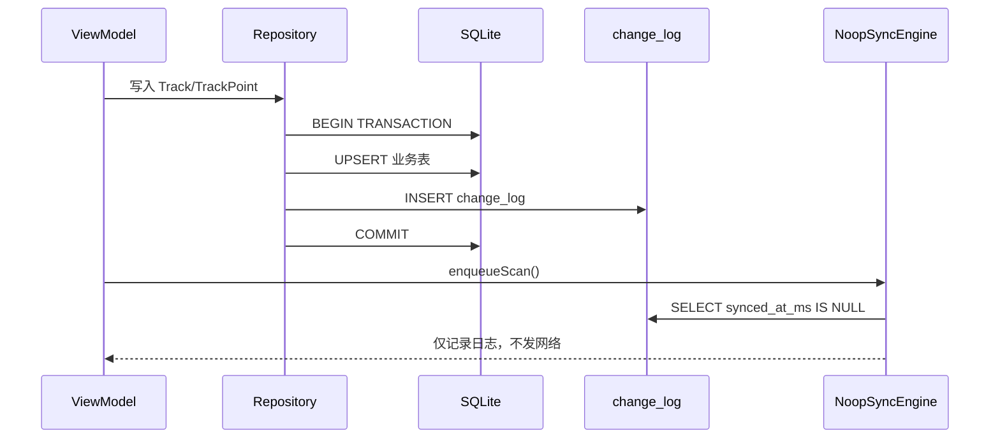

# recoow 数据模型

本文档描述第一阶段本地优先数据层。当前实现仅包含 SQLite/GRDB、本地 outbox 和 NoopSyncEngine，不包含网络同步。

## 1. 概念模型

核心实体：

- Track：一次轨迹记录会话，保存开始/结束时间、采样精度和汇总统计。
- TrackPoint：轨迹中的单个定位点，属于一个 Track，按时间追加写入。
- ChangeLog：本地 outbox，记录业务表的 insert/update/delete 意图，后续由 SyncEngine 推送到服务端。



## 2. 逻辑模型

所有可同步表共享同步元数据列：

| 列 | 类型 | 默认 | 用途 |
| --- | --- | --- | --- |
| id | TEXT | UUID | 主键，多端不冲突 |
| created_at | INTEGER | now ms | 创建时间戳 |
| updated_at | INTEGER | now ms | 改动时间戳，LWW 比较键 |
| deleted_at | INTEGER | NULL | 软删除，同步删除需要保留 tombstone |
| sync_status | INTEGER | 0 | 0=本地待同步，1=已同步，2=冲突 |
| device_id | TEXT | 当前设备 | LWW 平票 tiebreak |
| server_version | INTEGER | NULL | 服务端拉取或 push ack 后填充 |

### tracks

| 字段 | 类型 | 约束 | 用途 |
| --- | --- | --- | --- |
| id | TEXT | PRIMARY KEY | 轨迹 ID |
| name | TEXT | NOT NULL | 展示名称 |
| started_at | INTEGER | NOT NULL | 开始时间，毫秒时间戳 |
| ended_at | INTEGER | NULL | 结束时间，毫秒时间戳 |
| desired_accuracy_m | INTEGER | NOT NULL | 用户选择精度：100/10/5 |
| distance_m | REAL | NOT NULL DEFAULT 0 | 总距离 |
| duration_s | INTEGER | NOT NULL DEFAULT 0 | 总时长 |
| avg_speed_mps | REAL | NULL | 平均速度 |
| max_speed_mps | REAL | NULL | 最大速度 |
| note | TEXT | NULL | 备注 |
| 同步元数据列 | - | - | 见上表 |

### track_points

| 字段 | 类型 | 约束 | 用途 |
| --- | --- | --- | --- |
| id | TEXT | PRIMARY KEY | 采样点 ID |
| track_id | TEXT | NOT NULL REFERENCES tracks(id) ON DELETE CASCADE | 所属轨迹 |
| latitude | REAL | NOT NULL | 纬度 |
| longitude | REAL | NOT NULL | 经度 |
| altitude | REAL | NULL | 海拔 |
| horizontal_acc | REAL | NULL | 水平精度 |
| vertical_acc | REAL | NULL | 垂直精度 |
| speed_mps | REAL | NULL | 速度 |
| course_deg | REAL | NULL | 航向 |
| timestamp_ms | INTEGER | NOT NULL | 采样时间，毫秒时间戳 |
| 同步元数据列 | - | - | 见上表 |

### change_log

| 字段 | 类型 | 约束 | 用途 |
| --- | --- | --- | --- |
| id | INTEGER | PRIMARY KEY AUTOINCREMENT | outbox 自增 ID |
| entity_table | TEXT | NOT NULL | 业务表名 |
| entity_id | TEXT | NOT NULL | 业务记录 ID |
| operation | TEXT | CHECK insert/update/delete | 操作类型 |
| payload_json | TEXT | NOT NULL | 变更快照 JSON |
| client_ts_ms | INTEGER | NOT NULL | 客户端产生时间 |
| attempt_count | INTEGER | NOT NULL DEFAULT 0 | 推送尝试次数 |
| last_error | TEXT | NULL | 最近失败原因 |
| synced_at_ms | INTEGER | NULL | 成功同步时间；NULL 表示待同步 |

## 3. 物理模型

DDL 与 `Core/Database/Migrations/V1_InitialSchema.swift` 保持一致。

```sql
CREATE TABLE tracks (
    id TEXT NOT NULL PRIMARY KEY,
    created_at INTEGER NOT NULL DEFAULT (CAST((julianday('now') - 2440587.5) * 86400000 AS INTEGER)),
    updated_at INTEGER NOT NULL DEFAULT (CAST((julianday('now') - 2440587.5) * 86400000 AS INTEGER)),
    deleted_at INTEGER,
    sync_status INTEGER NOT NULL DEFAULT 0,
    device_id TEXT NOT NULL,
    server_version INTEGER,
    name TEXT NOT NULL,
    started_at INTEGER NOT NULL,
    ended_at INTEGER,
    desired_accuracy_m INTEGER NOT NULL,
    distance_m REAL NOT NULL DEFAULT 0,
    duration_s INTEGER NOT NULL DEFAULT 0,
    avg_speed_mps REAL,
    max_speed_mps REAL,
    note TEXT
);

CREATE INDEX idx_tracks_updated_at ON tracks(updated_at);
CREATE INDEX idx_tracks_started_at_desc ON tracks(started_at);

CREATE TABLE track_points (
    id TEXT NOT NULL PRIMARY KEY,
    created_at INTEGER NOT NULL DEFAULT (CAST((julianday('now') - 2440587.5) * 86400000 AS INTEGER)),
    updated_at INTEGER NOT NULL DEFAULT (CAST((julianday('now') - 2440587.5) * 86400000 AS INTEGER)),
    deleted_at INTEGER,
    sync_status INTEGER NOT NULL DEFAULT 0,
    device_id TEXT NOT NULL,
    server_version INTEGER,
    track_id TEXT NOT NULL REFERENCES tracks(id) ON DELETE CASCADE,
    latitude REAL NOT NULL,
    longitude REAL NOT NULL,
    altitude REAL,
    horizontal_acc REAL,
    vertical_acc REAL,
    speed_mps REAL,
    course_deg REAL,
    timestamp_ms INTEGER NOT NULL
);

CREATE INDEX idx_track_points_track_id_timestamp_ms ON track_points(track_id, timestamp_ms);

CREATE TABLE change_log (
    id INTEGER PRIMARY KEY AUTOINCREMENT,
    entity_table TEXT NOT NULL,
    entity_id TEXT NOT NULL,
    operation TEXT NOT NULL CHECK(operation IN ('insert','update','delete')),
    payload_json TEXT NOT NULL,
    client_ts_ms INTEGER NOT NULL,
    attempt_count INTEGER NOT NULL DEFAULT 0,
    last_error TEXT,
    synced_at_ms INTEGER
);

CREATE INDEX idx_change_log_synced_at_ms ON change_log(synced_at_ms);
```

存储估算：

- 一个 TrackPoint 的业务字段加同步元数据约 80 字节，不含 SQLite 页和索引开销。
- 10Hz 采样 1 小时约 36,000 个点，原始点数据约 2.8MB。
- 实际占用会因页大小、索引和 JSON outbox 快照增加，后续可按轨迹归档或压缩旧 outbox。

## 4. 同步语义

写入规约：

- Repository 的所有写操作必须使用 `database.writer.write`。
- 同一个事务内先写业务表，再追加 `change_log`。
- 如果进程在事务提交前被杀，业务数据和同步意图都不会落库。
- 如果事务提交后被杀，`change_log.synced_at_ms IS NULL` 会在下次启动时继续被扫描。



冲突策略：

- 使用 Last-Write-Wins。
- `updated_at` 较大的记录获胜。
- `updated_at` 相等时，`device_id` 字典序较大的记录获胜，保证所有端得到确定性结果。

## 5. 新功能扩展流程

1. 在 `Features/<NewModule>/` 下创建 `Models/Repository/ViewModels/Views`。
2. 在 `Core/Database/Migrations/V<n>_*.swift` 新增迁移；可同步实体表使用 `t.syncMetadata()` 复用同步列。
3. Repository 写操作必须走 `database.writer.write` 事务，并在同一事务内调用 `ChangeLogRepository.append`。
4. 在 `AppContainer` 注册新 Repository 或 ViewModel 工厂。
5. 在 `AppRoot` 添加工具入口或新的 Tab。
6. 在本文档追加该 feature 的概念模型、逻辑模型和物理模型小节。
Deployment
